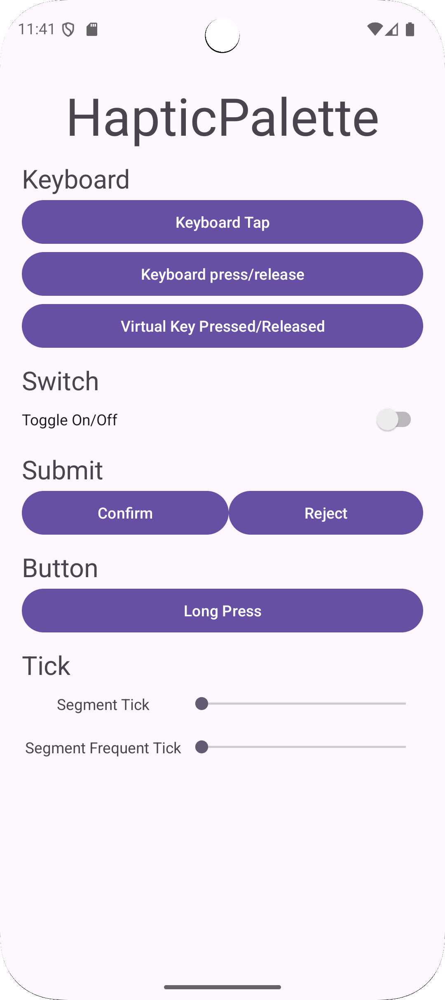

# HapticPalette
An Android app allowing developers to test haptic capabilities and options of the `HapticFeedbackConstants` class offered by Android.

# Features
* Test the following HapticFeedbackConstants:
  * `KEYBOARD_TAP`
  * `KEYBOARD_PRESS`
  * `KEYBOARD_RELEASE`
  * `VIRTUAL_KEY`
  * `VIRTUAL_KEY_RELEASE`
  * `TOGGLE_ON`
  * `TOGGLE_OFF`
  * `CONFIRM`
  * `REJECT`
  * `LONG_PRESS`
  * `SEGMENT_TICK`
  * `SEGMENT_FREQUENT_TICK`
* Support Dark Mode and Material You
* Test haptic capability and fidelity of various devices